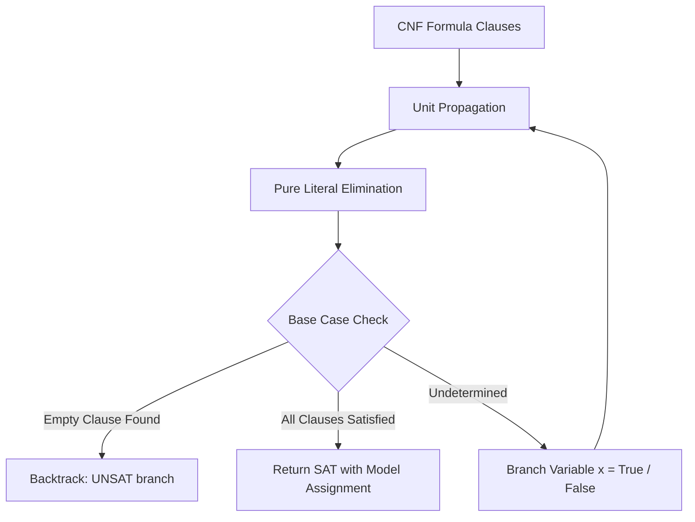

# GenPark DPLL SAT Solver Boolean Satisfiability Skill

Davis-Putnam-Logemann-Loveland (DPLL) Boolean CNF satisfiability solver with unit propagation and pure literal elimination.

Explore more at [GenPark](https://genpark.ai) and the [GenPark MCP Catalog](https://genpark.ai/mcp).

## Features
- Complete pure Python DPLL CNF solver.
- Fast unit clause reduction and pure literal simplification.
- Zero external dependencies.
